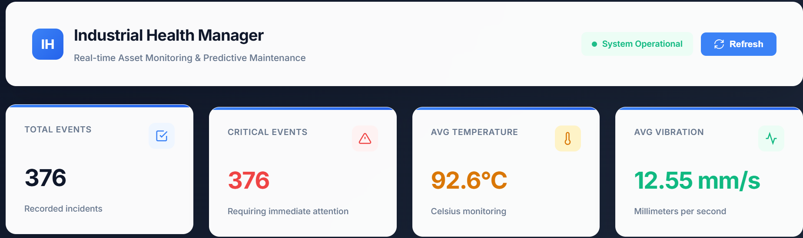
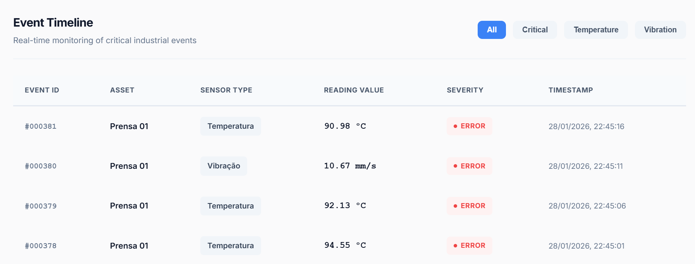

# Industrial Health Manager

**DEMONSTRAÇÃO:** https://industrial-health-manager.onrender.com

Sistema de monitoramento industrial em tempo real com manutenção preditiva. Simula sensores, processa telemetria e persiste eventos críticos para análise.





---

## Português

### Sobre o Projeto

Gêmeo Digital para monitoramento de ativos industriais. O sistema executa simulação multithread de sensores, aplica regras de negócio para classificação de severidade e armazena eventos críticos em banco de dados PostgreSQL.

### Funcionalidades

- Simulação multithread de sensores (Temperatura e Vibração)
- Processamento em tempo real com classificação de severidade
- Persistência seletiva de eventos críticos
- API REST para consulta de dados
- Dashboard responsivo com filtros dinâmicos
- Atualização automática de métricas

### Stack Tecnológica

**Backend:** Java 17, Spring Boot 3.2, Spring Data JPA  
**Frontend:** HTML5, CSS3, JavaScript  
**Banco de Dados:** PostgreSQL 15  
**Infraestrutura:** Docker, Docker Compose  
**Deploy:** Render

### Regras de Negócio

**NORMAL:** Temperatura < 75°C e Vibração < 5mm/s  
**ALERTA:** Temperatura entre 75°C e 85°C  
**CRÍTICO:** Temperatura > 85°C ou Vibração > 10mm/s

Apenas eventos críticos são persistidos no banco de dados.

### Arquitetura
```
Presentation Layer (HTML/CSS/JS)
         ↓
Application Layer (Spring Boot Controllers)
         ↓
Business Layer (Services)
         ↓
Persistence Layer (JPA Repositories)
         ↓
Database Layer (PostgreSQL)
```

### Executar Localmente

**Pré-requisitos:** Docker Desktop, Git
```bash
git clone https://github.com/JazzGEO/industrial-health-manager.git
cd industrial-health-manager
docker-compose up --build
```

**Acessar:**
- Dashboard: http://localhost:8080
- API: http://localhost:8080/assets/health

### Estrutura do Projeto
```
src/main/
├── java/com/industrial/healthmanager/
│   ├── config/
│   ├── controller/
│   ├── model/
│   ├── repository/
│   ├── service/
│   └── HealthManagerApplication.java
└── resources/
    ├── static/index.html
    └── application.properties
```

### API

`GET /assets/health` - Retorna eventos críticos  
`GET /` - Dashboard de monitoramento

---

## English

### About

Digital Twin system for real-time industrial asset monitoring with predictive maintenance. Simulates sensors, processes telemetry, and persists critical events for analysis.

### Features

- Multithreaded sensor simulation (Temperature and Vibration)
- Real-time processing with severity classification
- Selective persistence of critical events
- REST API for data queries
- Responsive dashboard with dynamic filters
- Automatic metrics updates

### Tech Stack

**Backend:** Java 17, Spring Boot 3.2, Spring Data JPA  
**Frontend:** HTML5, CSS3, JavaScript  
**Database:** PostgreSQL 15  
**Infrastructure:** Docker, Docker Compose  
**Deployment:** Render

### Business Rules

**NORMAL:** Temperature < 75°C and Vibration < 5mm/s  
**WARNING:** Temperature between 75°C and 85°C  
**CRITICAL:** Temperature > 85°C or Vibration > 10mm/s

Only critical events are persisted in the database.

### Architecture
```
Presentation Layer (HTML/CSS/JS)
         ↓
Application Layer (Spring Boot Controllers)
         ↓
Business Layer (Services)
         ↓
Persistence Layer (JPA Repositories)
         ↓
Database Layer (PostgreSQL)
```

### Run Locally

**Prerequisites:** Docker Desktop, Git
```bash
git clone https://github.com/JazzGEO/industrial-health-manager.git
cd industrial-health-manager
docker-compose up --build
```

**Access:**
- Dashboard: http://localhost:8080
- API: http://localhost:8080/assets/health

### Project Structure
```
src/main/
├── java/com/industrial/healthmanager/
│   ├── config/
│   ├── controller/
│   ├── model/
│   ├── repository/
│   ├── service/
│   └── HealthManagerApplication.java
└── resources/
    ├── static/index.html
    └── application.properties
```

### API

`GET /assets/health` - Returns critical events  
`GET /` - Monitoring dashboard

---
